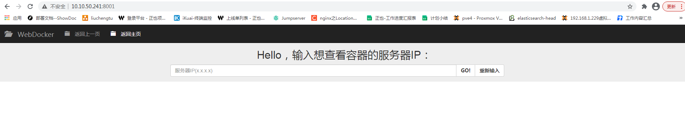

### Web Docker基础网页方案

----

[TOC]

#### 1.实现页面

* 权限基础页面

#### 2.主要实现功能

* 列表展示：
* 根据用户输入的服务器IP，来显示目标服务器的所有docker容器的ID、Names、服务器IP、容器状态。

* 重启指定容器：
  * 每个容器最后都对应着重启按钮，点击按钮可以重启容器。

#### 3.界面展示


#### 4.源码组成部分

* Python Flask启动+路由文件：[app.py](./app.py)

* 前端基础模板文件：[base.html](./templates/base.html)
* 表格展示文件：[table.html](./templates/table.html)

#### 5.用到的模块和方法

* Flask模块
  * render_template方法
  * request方法
  * url_for方法

* flask-bootstrap模块
* docker-py模块

#### 6.逻辑流程图


1. 用户在模板页面上输入服务器IP/点击重启按钮操作

2. 请求定位到根路由，路由函数判断请求方法

   * 如果请求方法为GET，则返回基础模板页面给用户。

   * 如果请求方法为POST，模板文件中，提交表单数据给路由函数

3. 连接目标服务器的docker服务，建立连接

4. 然后判断用户是否执行了重启按钮操作：

   * 如果进行了重启，则执行重启容器操作，然后判断容器是否重启成功：
     * 如果容器重启成功，则将容器重启结果变量设置为True。
     * 如果容器重启失败，则将容器重启结果变量设置为False。

   * 如果没有进行重启，则不进行任何操作

5. 获取目标服务器的所有容器的信息，获取统计目标服务器容器的总个数，生产一个数字序列，用于模板进行遍历。
6. 将容器信息、数字序列、容器重启结果变量、服务器IP、重启按钮表单数据（指定容器ID）作为参数，回传给表格模板。

#### 7.部署条件

* 想要访问的目标服务器的docker服务必须开启API。
* 部署服务器上要安装Python3

  * 模块清单：

    ```markdown
    virtualenv==20.4.2
    certifi==2020.12.5
    chardet==4.0.0
    click==7.1.2
    docker-py==1.10.6
    docker-pycreds==0.4.0
    dominate==2.6.0
    Flask==1.1.2
    Flask-Bootstrap==3.3.7.1
    gunicorn==20.0.4
    idna==2.10
    itsdangerous==1.1.0
    Jinja2==2.11.3
    MarkupSafe==1.1.1
    requests==2.25.1
    six==1.15.0
    urllib3==1.26.3
    visitor==0.1.3
    websocket-client==0.57.0
    Werkzeug==1.0.1
    ```

* 用gunicorn做web服务器启动项目。
* 用Nginx web服务做反向代理，代理到gunicorn容器上。

#### 8.简单部署操作流程

1. 创建项目目录，并将项目上传到部署服务器上

2. 利用virtualenv创建虚拟环境：

   ```shell
   pip install virtualenv
   cd myproject
   virtualenv venv
   source venv/bin/activate
   ```

3. 安装所需的模块：

   ```shell
   pip install -r requirements.txt
   ```
   
4. 安装Supervisor来后台管理：

   ```shell
   apt-get install supervisor
   ```

   * 编辑配置文件，添加项目配置（自定义修改）：

     ```shell
     [program:app]
     command=/usr/local/bin/gunicorn -w4 -b0.0.0.0:5001 app:app
     Directory=/root/web-docker/
     stdout_logfile=/root/web-docker/log/gunicorn.log
     stderr_logfile=/root/web-docker/log/gunicorn.err
     ```

5. 启动Supervisor：

   ```shell
   supervisord -c /etc/supervisor/supervisor.conf
   supervisorctl status
   ```

6. 配置Nginx（自定义）：

   ```shell
   vi /usr/local/nginx/conf/nginx.conf
   server {
   	listen 8001;
   	server_name	localhost;
   	
   	location / {
   		proxy_pass	http://10.10.50.241:5001;
   	}
   }
   ```

#### 9.测试

* 浏览器输入地址10.10.50.241:8001访问测试：

